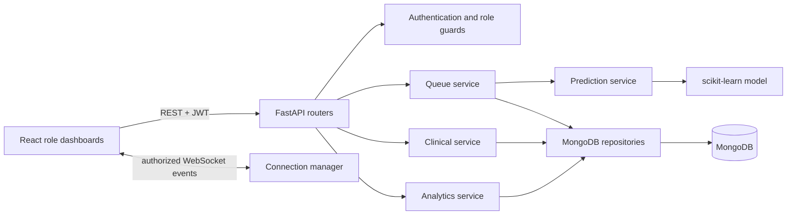

# OPD SmartQueue

> **A real-time outpatient queue and clinical-workflow coordination system built with React, FastAPI, MongoDB, WebSockets, and role-based access control.**

OPD SmartQueue gives patients clear visibility of their own outpatient token while providing doctors, nurses, and administrators with role-scoped operational workspaces. The application is designed for queue coordination and visit workflow support. It does **not** provide diagnosis, treatment recommendations, emergency triage, or clinical decision-making.

## Capabilities

| Area | Implemented capability |
| --- | --- |
| Patient experience | Registration and sign-in, department and doctor selection, token creation, live position, waiting estimate, status-aware return guidance, history, and notifications. |
| Doctor workflow | View an assigned daily queue, call the next eligible patient, start or complete consultation, skip a patient, and view relevant nurse-recorded observations during an active consultation. |
| Nurse workflow | View authorized department visits, record, edit, or delete own vital observations for an active visit, and review permitted history. |
| Administration | Filtered MongoDB-backed operational analytics for queue load, patient counts, waiting trends, consultation duration, and clinician workload. |
| Queue integrity | Atomic department-day token sequencing, priority-aware FIFO ordering, guarded state transitions, and database constraints for active patient and clinician queues. |
| Live updates | Authorized FastAPI WebSocket channels signal queue changes; the client re-fetches REST state as the source of truth. |
| Wait-time estimates | A configurable baseline enriched by a serialized regression model when one is available; the service falls back safely to the baseline otherwise. |

## Architecture

| Layer | Technology |
| --- | --- |
| Web client | React 19, TypeScript, Vite, Tailwind CSS, Wouter, Recharts |
| API | Python, FastAPI, Uvicorn, Pydantic |
| Persistence | MongoDB Atlas or MongoDB Community Server, Motor, PyMongo |
| Security | JWT authentication, bcrypt password hashing, role-based authorization, scoped WebSocket access, persisted login-rate limiting |
| Live transport | Native browser WebSocket API and FastAPI WebSockets using JWT in the `Sec-WebSocket-Protocol` pair |
| Prediction | NumPy, Pandas, scikit-learn, joblib |
| Deployment | Render static-site frontend and Render Python API, defined in [`render.yaml`](render.yaml) |



## Roles and Access Boundaries

| Role | Permitted scope |
| --- | --- |
| Patient | Own profile, tokens, queue status, waiting guidance, notifications, and permitted history. |
| Doctor | Assigned daily queue, eligible queue transitions, and observations for the active consultation patient. |
| Nurse | Department-assigned active visits and nurse-owned vital observations. |
| Admin | Aggregate operational analytics and permitted administration functions. |

The backend enforces role checks and ownership checks independently of the frontend. A WebSocket client receives only the channel for which it is authorized.

## Queue Lifecycle

| Current status | Allowed next status |
| --- | --- |
| `WAITING` | `CALLED`, `CANCELLED` |
| `CALLED` | `IN_CONSULTATION`, `SKIPPED` |
| `IN_CONSULTATION` | `COMPLETED` |
| `COMPLETED`, `SKIPPED`, `CANCELLED` | Terminal |

Tokens are assigned a department-specific daily sequence. MongoDB atomic counters create the sequence, and compound indexes guard against duplicate issuance. The system also enforces at most one active token per patient per day and at most one called or in-consultation token per doctor per day.

Patient guidance is status-aware. Waiting estimates are shown only while a token is `WAITING`; a called patient is directed to proceed to the consultation area, and an in-consultation patient sees a consultation-in-progress state rather than a misleading estimate.

## Prerequisites

| Requirement | Supported version or service |
| --- | --- |
| Node.js | 22 or later recommended |
| Package manager | pnpm 10.4.1, pinned in `package.json` |
| Python | 3.11 or later recommended |
| Database | MongoDB Atlas or MongoDB Community Server |

## Local Setup

### 1. Configure the backend

Create a virtual environment and install the API dependencies.

```bash
cd backend
python -m venv .venv
source .venv/bin/activate       # Windows PowerShell: .venv\Scripts\Activate.ps1
python -m pip install -r requirements.txt
```

Create `backend/.env` using [`backend/ENVIRONMENT.md`](backend/ENVIRONMENT.md) as the reference. At minimum, supply a MongoDB connection string, database name, long random JWT secret, frontend origin, and `APP_ENV=development`. Keep this file out of version control.

```dotenv
MONGODB_URL=<your MongoDB connection string>
DATABASE_NAME=opd_queue_management
JWT_SECRET=<long random secret>
FRONTEND_URL=http://localhost:3000
APP_ENV=development
```

Start the FastAPI service:

```bash
cd backend
uvicorn app.main:app --reload --port 8000
```

Interactive API documentation is available at `http://127.0.0.1:8000/docs` when the service is running.

### 2. Configure and start the frontend

Set `VITE_API_BASE_URL` to the local API URL in a root `.env` file if the default is not appropriate.

```dotenv
VITE_API_BASE_URL=http://127.0.0.1:8000
```

Install and run the React client from the repository root.

```bash
npx --yes pnpm@10.4.1 install --frozen-lockfile
npx --yes pnpm@10.4.1 dev
```

The Vite development server runs on `http://localhost:3000` by default.

## Database Initialization and Test Data

The project includes an idempotent Atlas-compatible seed script that creates realistic, namespaced test users, profiles, departments, queues, observations, notifications, consultations, and analytics history using the existing MongoDB schema.

> Use only a non-production database for seeded test data. Provide the test password at execution time; do not place it in source code, documentation, or committed environment files.

```bash
cd backend
python scripts/seed_atlas_data.py --apply --password "$OPD_TEST_PASSWORD"
```

The machine-learning dataset, model artifact, metrics, and visualizations are generated development outputs and are intentionally excluded from Git. Regenerate them when required:

```bash
cd backend
python -m app.ml.generate_demo_data
python -m app.ml.train_model
python -m app.ml.eda
```

## Verification

Run the following checks before opening a pull request or deploying a change.

```bash
# Frontend type-check and production bundle
npx --yes pnpm@10.4.1 check
npx --yes pnpm@10.4.1 build

# Backend tests
cd backend
APP_ENV=development pytest -q
```

With a seeded, reachable API, the maintained workflow verification scripts exercise real authentication, role boundaries, queue state changes, vitals, analytics, and WebSockets:

```bash
cd backend
OPD_API_URL=http://127.0.0.1:8000 OPD_TEST_PASSWORD="$OPD_TEST_PASSWORD" node scripts/verify_seeded_workflows.mjs
OPD_API_URL=http://127.0.0.1:8000 OPD_TEST_PASSWORD="$OPD_TEST_PASSWORD" node scripts/verify_live_vital_collaboration.mjs
```

Use the service probes for deployment readiness:

```bash
curl -fsS https://opd-smartqueue-api.onrender.com/health
curl -fsS https://opd-smartqueue-api.onrender.com/ready
```

## Deployment

[`render.yaml`](render.yaml) defines two auto-deployed Render services:

| Service | Runtime | Responsibility |
| --- | --- | --- |
| `opd-smartqueue-api` | Python web service | FastAPI application, MongoDB connection, authentication, APIs, and WebSockets. |
| `opd-smartqueue-web` | Render static site | Vite production build served from `dist/public`, including the SPA fallback rewrite. |

Configure the database connection string and frontend/API origins as environment values in Render. Keep the database connection string, JWT secret, and any operational credentials in the host’s secret-management interface rather than the repository.

## Project Structure

```text
opd-smartqueue/
├── backend/
│   ├── app/
│   │   ├── auth/           # JWT and authorization guards
│   │   ├── database/       # MongoDB lifecycle and indexes
│   │   ├── ml/             # Dataset generation, training, and inference
│   │   ├── repositories/   # MongoDB access layer
│   │   ├── routers/        # REST and WebSocket routes
│   │   ├── services/       # Queue, clinical, analytics, notification logic
│   │   └── websocket/      # Connection manager
│   ├── scripts/            # Seed and live verification tools
│   └── tests/              # Backend and MongoDB integration tests
├── client/
│   ├── public/queue-assets/# Required bundled UI assets
│   └── src/                # React routes, dashboards, services, and UI primitives
├── docs/                   # Deployment and feature notes
├── render.yaml             # Render Blueprint
└── README.md
```

## Security and Privacy Notes

Passwords are hashed before storage. JWTs protect authenticated APIs and WebSockets; patient ownership and role checks scope data access. Important queue and clinical-workflow actions create audit records without storing passwords or JWT values.

This repository is an operational prototype, not a certified hospital information system. Any production rollout requires formal security review, healthcare compliance review, organization-specific privacy controls, backup and incident procedures, user-lifecycle governance, and clinical oversight.

## License

This project is distributed under the MIT license. See the `license` field in [`package.json`](package.json).
