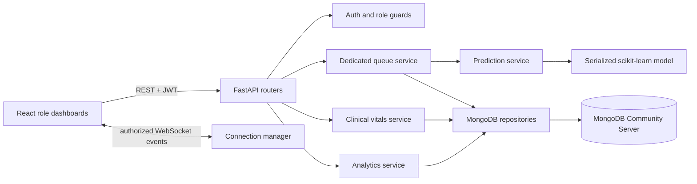

# OPD SmartQueue

> **Real-time Patient Vitals & Intelligent OPD Queue Management System**

OPD SmartQueue is a local-run, full-stack demonstration application for outpatient queue visibility and workflow coordination. It combines a **React** user interface with a **FastAPI** service, **MongoDB** document persistence, FastAPI **WebSockets**, role-based access control, workflow-only vitals capture, aggregated analytics, and a synthetic-data wait-time regression pipeline.

> **Healthcare disclaimer:** This application is a demonstration system for OPD queue and workflow management. Waiting-time predictions are estimates and may change according to real-time queue conditions. It is **not** intended for medical diagnosis, treatment recommendation, emergency triage, or clinical decision-making.

## Problem and Motivation

OPD tokens traditionally provide a number but little operational context. Patients do not know the current token, the pace of movement, whether the doctor is consulting, or when it makes sense to return. The resulting uncertainty can create avoidable physical waiting. OPD SmartQueue makes a patient’s own queue position visible while providing clinicians with guarded workflow controls and administrators with aggregate operational signals.

The system intentionally separates **workflow support** from clinical decision-making. Priority is assigned only by authorized staff; vital observations are stored for a visit workflow and never interpreted by the application.

| Objective | Implementation |
|---|---|
| Digitize OPD tokens | Department-coded, daily sequential tokens generated with MongoDB atomic counters. |
| Show real-time queue context | REST for authoritative reads plus FastAPI WebSocket signals for state changes. |
| Maintain role boundaries | JWT authentication, patient ownership checks, role-gated routes, and scoped WebSocket channels. |
| Estimate waiting time responsibly | Configurable rule-based baseline plus a serialized, evaluated regression model and explicit estimate ranges. |
| Support clinical workflow, not diagnosis | Nurse-entered vital observations are validated and available only to authorized workflow roles. |

## User Roles

| Role | Primary capabilities |
|---|---|
| Patient | Register, sign in, select a department and doctor, receive a token, view their own live position, estimate, return window, history, and notifications. |
| Doctor | View the assigned daily queue; call, start, complete, or skip an eligible token; update status; view relevant patient vitals. |
| Nurse | Review active visits and record validated temperature, heart rate, blood pressure, and SpO2 observations. |
| Admin | Review aggregate queue and consultation activity, department/doctor workload, audit records, and ML development metrics. |

## Technology Constraints

The application intentionally uses **MongoDB as its only application database**, FastAPI WebSockets rather than Socket.IO, and local Python tooling for data science. It does **not** use Docker, Docker Compose, PostgreSQL, MySQL, SQLite as the application database, Redis, Firebase, or Socket.IO.

| Layer | Technology |
|---|---|
| Frontend | React 19, Vite, TypeScript, Tailwind CSS, Recharts, browser WebSocket API |
| Backend | Python, FastAPI, Uvicorn, Pydantic, Motor/PyMongo |
| Authentication | JWT, Passlib bcrypt password hashing, role authorization |
| Database | MongoDB Community Server at `mongodb://localhost:27017` |
| Data science | NumPy, Pandas, Matplotlib, Seaborn, scikit-learn, joblib |
| Testing | Pytest and FastAPI-ready service structure |

## Architecture

The React application uses REST APIs for fetches and mutations. FastAPI owns authentication, authorization, queue transitions, notifications, analytics, and the prediction integration. MongoDB preserves the historical source of truth; `queue_states` is an optimized live snapshot rather than a replacement for token history.



The **Clinical Flight Deck** interface uses a warm porcelain canvas, mineral navy context, and Queue Teal as the live-state signal. Patient views lead with token context and estimate caveats; doctor, nurse, and administrator workspaces surface only their operational controls.

## MongoDB Collection Design

| Collection | Responsibility | Representative indexes |
|---|---|---|
| `users` | Identity, email, password hash, role, activity state | unique `email`; `role` |
| `patients` | Patient-specific minimum necessary profile | unique `user_id` |
| `doctors` | Department assignment, specialization, availability | unique `user_id`; `department_id + status` |
| `departments` | Active OPD departments and token code | unique `name`; unique `code` |
| `tokens` | Historical source of truth for token lifecycle | unique `department_id + queue_date + sequence`; doctor live-queue compound index; patient history index |
| `consultations` | Consultation start/end/duration records | `doctor_id + created_at`; `patient_id + created_at` |
| `vitals` | Workflow-only observations for a patient visit | `token_id`; `patient_id + recorded_at` |
| `notifications` | Persisted patient updates and read state | `user_id + is_read + created_at` |
| `queue_states` | Current per-doctor daily snapshot | unique `doctor_id + queue_date` |
| `ml_predictions` | Versioned prediction output | `token_id + created_at` |
| `audit_logs` | Security-sensitive operational actions | `timestamp`; `user_id + timestamp` |
| `counters` | Atomic department-day token sequence | `_id` is `<departmentId>_<YYYY-MM-DD>` |

These indexes match the dominant query paths: authenticating by email, resolving active tokens by doctor/day/status, locating a patient’s history, and serving recent notifications. MongoDB Community Server provides the local document-store environment used by the project; obtain the correct installation package for the operating system from the official Community download page. [1]

## Queue Algorithm and Token Safety

Token numbers are department-specific and daily, such as `C-150`. `QueueRepository.next_sequence()` uses MongoDB `findOneAndUpdate`, `$inc`, and `upsert` against a department-day counter. A unique compound index on `(department_id, queue_date, sequence)` provides a second line of protection against duplicate issuance.

The dedicated queue service implements priority-aware FIFO ordering. Staff-supplied priority has a fixed rank: `EMERGENCY`, `HIGH`, then `NORMAL`; tokens within the same priority retain creation-order FIFO behavior. State transitions are guarded by the current status in the MongoDB update filter, preventing two browser sessions from successfully calling or completing the same token simultaneously.

| Valid operational state | Supported next transition |
|---|---|
| `WAITING` | `CALLED`, `CANCELLED` |
| `CALLED` | `IN_CONSULTATION`, `SKIPPED` |
| `IN_CONSULTATION` | `COMPLETED` |
| `COMPLETED`, `SKIPPED`, `CANCELLED` | Terminal states |

## Waiting-Time Estimation

The application uses two levels of estimate. The baseline is derived from `patients_ahead × expected_consultation_duration`. The expected duration is calculated from available recent, today, doctor-specific, and department-specific consultation history; the weights are configured via local environment variables rather than scattered in route code.

The prediction service then loads a serialized model once. It uses queue load, time-of-day, day-of-week, doctor/department identity, duration averages, completions, and current doctor status to provide an approximate range. If a model is unavailable, the API stays operational by falling back to the baseline. Every response includes the notice that waiting time may change with real-time queue conditions.

## Synthetic Dataset and ML Results

`backend/app/ml/generate_demo_data.py` produces a labelled synthetic development dataset. It is not claimed to represent real hospital patients, consultations, or outcomes. `train_model.py` performs a reproducible train/test split, evaluates three regression models, chooses the smallest observed MAE, writes metrics, and serializes the selected pipeline to `backend/app/ml/models/wait_time_model.joblib`.

| Model | MAE | RMSE | R² |
|---|---:|---:|---:|
| Linear Regression | 7.993 | 10.408 | 0.9541 |
| Random Forest Regressor | **5.215** | 6.730 | 0.9808 |
| Gradient Boosting Regressor | 5.218 | **6.657** | **0.9812** |

**Random Forest Regressor** is selected because it has the lowest measured MAE in the synthetic development experiment. MAE measures average absolute error in minutes; RMSE penalizes larger errors more strongly; R² describes explained variance on the held-out synthetic test set. The EDA script writes distributions, queue relationships, and hourly-load visuals to `backend/app/ml/eda/`.

## REST API Surface

| Area | Endpoint examples |
|---|---|
| Authentication | `POST /api/auth/register`, `POST /api/auth/login`, `GET /api/auth/me` |
| Catalogue | `GET /api/departments`, `GET /api/doctors`, `GET /api/doctors/{id}/availability` |
| Patient | `GET /api/patients/me`, `GET /api/patients/me/tokens`, `GET /api/patients/me/notifications` |
| Queue | `POST /api/queue/token`, `GET /api/queue/token/{id}`, `GET /api/queue/token/{id}/position` |
| Doctor workflow | `GET /api/doctors/me/queue`, `POST /api/doctors/me/call-next`, `POST /api/doctors/me/start-consultation`, `POST /api/doctors/me/complete-consultation`, `POST /api/doctors/me/skip-patient` |
| Vitals | `POST /api/vitals`, `GET /api/vitals/{patient_id}` |
| Predictions | `GET /api/predictions/wait-time/{token_id}` |
| Analytics | `GET /api/analytics/overview`, `/departments`, `/doctors`, `/hourly` |

Successful responses use `{ "success": true, "data": ..., "message": ... }`. Operational errors return `{ "success": false, "message": ..., "error_code": ... }` without exposing internal exceptions. When running, FastAPI’s interactive API documentation is available at `http://127.0.0.1:8000/docs`.

## WebSocket Architecture

The connection manager exposes scoped channels:

| Channel | Purpose | Authorization boundary |
|---|---|---|
| `/ws/queue/{department_id}` | Department-level, minimum-necessary queue movement | Valid authenticated session |
| `/ws/patient/{patient_id}` | A patient’s own queue updates and notifications | Patient token owner only |
| `/ws/doctor/{doctor_id}` | Doctor’s assigned queue updates | Assigned doctor only |

The browser client treats a WebSocket message as a **change signal**. After reconnecting, it fetches authoritative REST state rather than trusting an old stream. Event types include `QUEUE_UPDATED`, `TOKEN_APPROACHING`, `YOUR_TURN`, `CONSULTATION_COMPLETED`, and `DOCTOR_STATUS_CHANGED`.

## Local Installation

### 1. Install MongoDB Community Server

Download **MongoDB Community Server** for your operating system from the official download page, selecting the corresponding platform and architecture. [1] MongoDB’s installation manual directs Community Edition users to select their operating-system-specific instructions. [2]

On Ubuntu systems installed as a service, start and inspect the service with:

```bash
sudo systemctl start mongod
sudo systemctl status mongod
mongosh --eval 'db.runCommand({ ping: 1 })'
```

On Windows, select the Community Server Windows installer, enable the MongoDB service during installation, then use `mongosh` to run the same ping command. Connect MongoDB Compass to `mongodb://localhost:27017`; the `opd_queue_management` database appears after the initialization script writes the first collections and indexes.

### 2. Configure the Backend

```bash
cd backend
python -m venv .venv
# macOS/Linux
source .venv/bin/activate
# Windows PowerShell
# .venv\Scripts\Activate.ps1
pip install -r requirements.txt
```

Create `backend/.env` according to [`backend/ENVIRONMENT.md`](backend/ENVIRONMENT.md). Do not commit this file.

Initialize MongoDB, create the indexes and default departments, seed local-only demonstration records, then train the synthetic-data model:

```bash
cd backend
python -m scripts.init_db --with-demo-admin
python -m scripts.seed_demo_data
python -m app.ml.train_model
python -m app.ml.eda
uvicorn app.main:app --reload --port 8000
```

### 3. Start the React Frontend

```bash
# from the project root
pnpm install
pnpm dev
```

The frontend runs through Vite at the configured local preview address (normally `http://localhost:3000` in this project). The API’s CORS allow-list is controlled with `FRONTEND_URL` in `backend/.env`.

### Demo Credentials

The seed script creates the following **local-only demonstration** credentials. Every account uses `DemoPass!123`; change or remove them outside development.

| Role | Email |
|---|---|
| Admin | `admin@opdsmartqueue.local` |
| Doctor | `dr.sharma@opdsmartqueue.local` |
| Nurse | `nurse.asha@opdsmartqueue.local` |
| Patient | `patient09@opdsmartqueue.local` |

The seeded patient flow mirrors the demonstration: current token `C-142`, patient token `C-150`, seven waiting patients ahead, a seven-minute baseline duration, a 49-minute baseline wait, and a model-driven approximate range. Demo data is always marked as synthetic or local-only.

## Tests and Quality Checks

Run the backend unit suite from `backend/`:

```bash
pytest -q
```

The current test suite verifies priority/FIFO ordering, confirms that the currently consulting token is excluded from `patients_ahead`, and checks password hashing plus JWT issue/decode behaviour. Additional operational testing should exercise token generation, guarded queue transitions, WebSocket disconnect/reconnect, vitals authorization, and admin-only analytics against a local MongoDB instance.

## Project Structure

```text
opd-smartqueue/
├── backend/
│   ├── app/
│   │   ├── auth/              # JWT and role guards
│   │   ├── database/          # Motor connection and indexes
│   │   ├── ml/                # Synthetic data, EDA, model training, inference
│   │   ├── queue/             # Pure ordering logic
│   │   ├── repositories/      # MongoDB access boundaries
│   │   ├── routers/           # REST and WebSocket endpoints
│   │   ├── services/          # Queue, analytics, notification, clinical business logic
│   │   └── websocket/         # Channel manager
│   ├── scripts/               # Index initialization and demo seeding
│   ├── tests/
│   └── requirements.txt
├── client/
│   └── src/
│       ├── contexts/          # Authenticated session state
│       ├── hooks/             # Reconnecting WebSocket client
│       ├── pages/             # Overview, sign-in, role dashboards
│       └── services/          # REST client
├── docs/PHASE_1_ARCHITECTURE.md
└── README.md
```

## Security and Privacy Boundaries

Passwords are hashed, JWT secrets are loaded from local environment configuration, protected routes enforce role checks, and sensitive queue/vitals data is scoped to the responsible patient or workflow role. Important token and vitals actions produce audit records without logging passwords or JWT values. WebSocket payloads are intentionally limited to the information required by the subscribed party.

This is a development demonstration rather than a certified hospital information system. Production use would require a formal security assessment, healthcare regulatory review, mature user lifecycle controls, operational monitoring, backup/restore policy, clinical governance, and organization-specific privacy safeguards.

## Future Improvements

Not implemented in this version: SMS or WhatsApp delivery, native mobile applications, QR-code tokens, kiosk support, multi-branch tenancy, cloud deployment, Redis-backed WebSocket scaling, real hospital data ingestion, appointment scheduling, hospital navigation, and external notification providers.

## References

[1] [MongoDB Community Server Download](https://www.mongodb.com/try/download/community)

[2] [MongoDB Installation Manual](https://www.mongodb.com/docs/manual/installation/)
