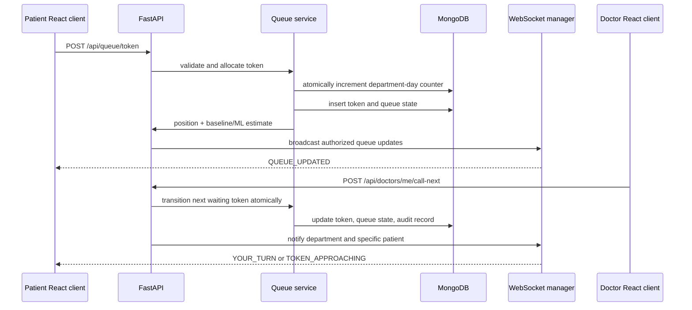

# Phase 1 — Architecture and Local Environment

> **Objective:** Establish a runnable React interface foundation, a clear local-only deployment model, and the architecture that will connect role-based hospital workflows to FastAPI, MongoDB, WebSockets, and a waiting-time prediction service.

## The Problem and Solution

OPD waiting is often opaque: patients receive a token but cannot see whether a clinician is consulting, how quickly the queue is moving, or when to return. OPD SmartQueue makes the queue observable without turning it into a clinical decision system. Patients receive a real-time position and an explicitly non-guaranteed waiting-time estimate; clinical staff receive role-appropriate operational controls; administrators receive aggregate throughput and performance visibility.

The application separates the authoritative workflow state from the presentation layer. MongoDB preserves token, consultation, vitals, notification, audit, and prediction records. A FastAPI service owns authentication, authorization, queue transitions, analytics, and prediction orchestration. Browser clients use REST for authoritative reads and FastAPI WebSockets for low-latency updates.

## Roles and Primary Workflows

| Role | Primary responsibility | Permitted workflow |
|---|---|---|
| Patient | Follow a personal OPD visit remotely | Register, select an available doctor, create a token, see only personal queue status and notifications. |
| Doctor | Move the assigned daily queue safely | Call the next eligible token, start and complete consultations, skip when authorized, view visit-relevant vitals. |
| Nurse | Capture workflow vitals | Locate a waiting visit, record validated observations, review previous entries; no diagnosis or treatment functionality. |
| Admin | Monitor and configure the service | Manage departments and staff records, review aggregate analytics, audit logs, and model-performance data. |

## End-to-End Flow

## Queue and Token Design

The queue is **doctor-specific within a department and day**, with department-level token numbering. A counter document is atomically incremented with `findOneAndUpdate`, `$inc`, and `upsert`, preventing duplicate token numbers across concurrent requests. Eligible tokens are ordered by explicit staff-assigned priority (`EMERGENCY`, `HIGH`, `NORMAL`) and then `created_at`, producing a deterministic priority-aware FIFO sequence.

All consequential transitions have guards. A token can move from `WAITING` to `CALLED`, `IN_CONSULTATION`, `COMPLETED`, `SKIPPED`, or `CANCELLED` only when its current status allows it. The update filter includes its expected current status so multiple browser sessions cannot successfully claim the same token transition.

## MongoDB Document Design

| Collection | Purpose | Important indexes |
|---|---|---|
| `users` | Authentication identity and role | unique `email`; `role` |
| `patients`, `doctors`, `departments` | Role-specific profiles and clinic configuration | unique department `name`/`code`; doctor `user_id`, `department_id` |
| `tokens` | Historical source of truth for all queue visits | unique `department_id + queue_date + sequence`; `doctor_id + queue_date + status + priority + created_at`; `patient_id + created_at` |
| `consultations` | Start/end timestamps and duration | `doctor_id + created_at`; `patient_id + created_at` |
| `vitals` | Nurse-recorded workflow observations | `token_id`; `patient_id + recorded_at` |
| `queue_states` | Fast current queue snapshot; not historical truth | unique `doctor_id + queue_date` |
| `notifications`, `ml_predictions`, `audit_logs` | Patient communications, estimate versions, auditable actions | `user_id + is_read + created_at`; `token_id`; `timestamp` |
| `counters` | Atomic per-department daily sequence | `_id` = `<department>_<YYYY-MM-DD>` |

## Waiting-Time and ML Design

The service returns two levels of estimate. The baseline calculates patients ahead multiplied by a configurable expected consultation duration, using weighted recent, today, doctor-specific, department-specific, and historical statistics. The prediction service then attempts to load a versioned scikit-learn model and supplies a clearly labeled approximate range. If model loading or inference fails, the baseline remains available and the failure is logged without interrupting queue operations.

The development dataset is synthetic and clearly labelled as such. The ML pipeline creates historical queue rows, engineers time, load, and duration features, compares Linear Regression, Random Forest, and Gradient Boosting models on a held-out set, stores actual MAE, RMSE, and R² metrics, and serializes only the best observed model.

## API and WebSocket Boundaries

REST endpoints use `/api` and return a consistent success envelope. `POST /api/queue/token` and doctor workflow endpoints invoke the queue service; routes do not own queue algorithms. WebSocket endpoints (`/ws/queue/{department_id}`, `/ws/patient/{patient_id}`, and `/ws/doctor/{doctor_id}`) authenticate the connection token, authorize the subscription, and deliver the minimum necessary payload. REST remains the recovery path after a disconnected client reconnects.

## Local Environment

| Component | Local command after implementation | Runtime purpose |
|---|---|---|
| MongoDB Community Server | `mongod --dbpath <data-path>` | Primary document database at `mongodb://localhost:27017` |
| FastAPI backend | `uvicorn app.main:app --reload --port 8000` from `backend/` | APIs, queue engine, WebSockets, analytics, ML integration |
| React frontend | `pnpm dev` from project root | Vite interface at the local preview URL |

Create `backend/.env` from `backend/.env.example`, set a strong local JWT secret, and do not commit the resulting file. The backend startup sequence initializes indexes and can be followed by `python scripts/init_db.py`, `python scripts/seed_demo_data.py`, `python -m app.ml.generate_demo_data`, and `python -m app.ml.train_model`.

## Phase-One Completion Checklist

- [x] The local architecture preserves **MongoDB only**, FastAPI, React, browser WebSockets, and Python ML.
- [x] Docker, PostgreSQL, MySQL, Redis, Firebase, and Socket.IO are excluded from the application design.
- [x] The visual design system, brand mark, accessibility intent, patient-facing disclaimer, and frontend foundation are documented.
- [x] The initial React interface runs independently while the FastAPI implementation is built in the next phase.

## Healthcare Disclaimer

This application is a demonstration system for OPD queue and workflow management. Waiting-time predictions are estimates and may change according to real-time queue conditions. It is not intended for medical diagnosis, treatment recommendation, emergency triage, or clinical decision-making.
